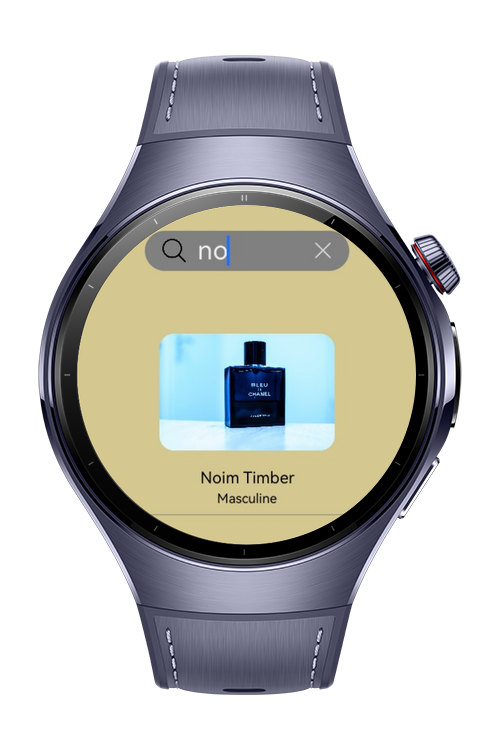

> **Note:** To access all shared projects, get information about environment setup, and view other guides, please visit [Explore-In-HMOS-Wearable Index](https://github.com/Explore-In-HMOS-Wearable/hmos-index).

# How to Search an Item

This project demonstrates how to search the items for the HarmonyOS Next apps

# Preview


# Use Cases
**Search**: The user can search an item in the search box

# Tech Stack

- **Languages**: ArkTS
- **Frameworks**: HarmonyOS SDK 5.0.2(14)
- **Tools**: DevEco Studio Vers 5.1.0.240SP1
- **Libraries**: @kit.ArkUI


# Directory Structure

   ```
entry/src/main/ets/
|---components
|---|---PerfumeComponent
|---|---SearchBar
|---model
|---|---PerfumeModel
|---pages
|---|---Index
|---viewmodel
|---|---PerfumeViewModel
|---entryability
|---|---EntryAbility
|---entrybackupability
|---|---EntryBackupAbility
   ```

# Constraints and Restrictions

## Supported Devices

- Huawei Watch 5

# License

How to Search an Item is distributed under the terms of the MIT License
See the [license](./LICENSE) for more information.
